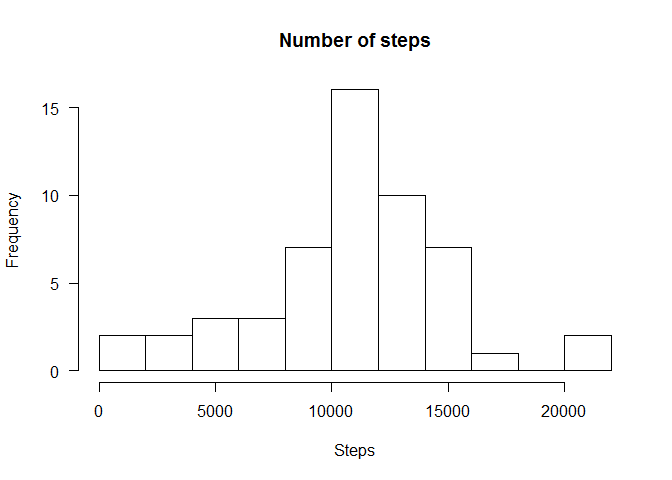
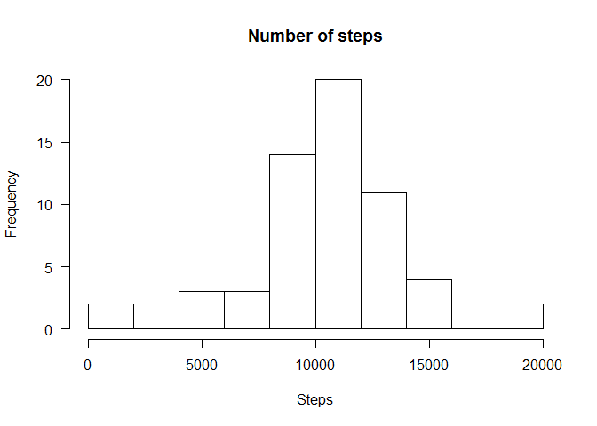
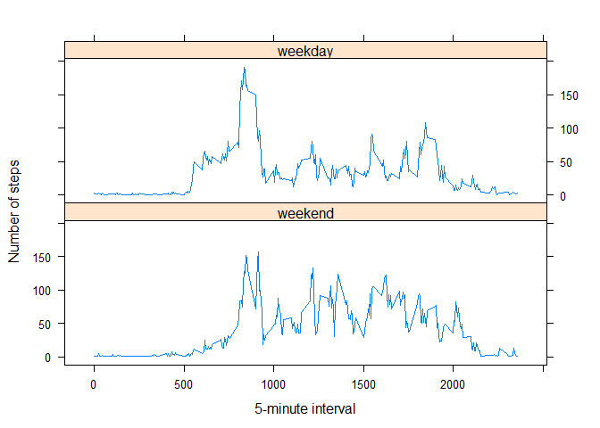

# Reproducible Research: Peer Assessment 1


## Loading and preprocessing the data

```r
require(knitr)
```

```
## Loading required package: knitr
```

```
## Warning: package 'knitr' was built under R version 3.1.3
```

```r
#include working directory so we do not need to reset in every interaction
opts_knit$set(root.dir = 'C:/DataScience')
```

```r
#read file from working directory
act <- read.csv(unz("repdata-data-activity.zip", "activity.csv"))
# histogram of the total number of steps taken each day. Remember to aggregate the number of steps per day
hist(tapply(act$steps, act$date, FUN = sum), main="Number of steps", xlab="Steps", las=1, breaks = 10)
```




## What is mean total number of steps taken per day?


```r
# Please notice that due to the large amount of zeros, median will be zero or NA for all dates. 
# Alternative is to exclude zeros (third and fourth cases below)
tapply(act$steps, act$date, FUN = mean, na.rm = TRUE)
```

```
## 2012-10-01 2012-10-02 2012-10-03 2012-10-04 2012-10-05 2012-10-06 
##        NaN  0.4375000 39.4166667 42.0694444 46.1597222 53.5416667 
## 2012-10-07 2012-10-08 2012-10-09 2012-10-10 2012-10-11 2012-10-12 
## 38.2465278        NaN 44.4826389 34.3750000 35.7777778 60.3541667 
## 2012-10-13 2012-10-14 2012-10-15 2012-10-16 2012-10-17 2012-10-18 
## 43.1458333 52.4236111 35.2048611 52.3750000 46.7083333 34.9166667 
## 2012-10-19 2012-10-20 2012-10-21 2012-10-22 2012-10-23 2012-10-24 
## 41.0729167 36.0937500 30.6284722 46.7361111 30.9652778 29.0104167 
## 2012-10-25 2012-10-26 2012-10-27 2012-10-28 2012-10-29 2012-10-30 
##  8.6527778 23.5347222 35.1354167 39.7847222 17.4236111 34.0937500 
## 2012-10-31 2012-11-01 2012-11-02 2012-11-03 2012-11-04 2012-11-05 
## 53.5208333        NaN 36.8055556 36.7048611        NaN 36.2465278 
## 2012-11-06 2012-11-07 2012-11-08 2012-11-09 2012-11-10 2012-11-11 
## 28.9375000 44.7326389 11.1770833        NaN        NaN 43.7777778 
## 2012-11-12 2012-11-13 2012-11-14 2012-11-15 2012-11-16 2012-11-17 
## 37.3784722 25.4722222        NaN  0.1423611 18.8923611 49.7881944 
## 2012-11-18 2012-11-19 2012-11-20 2012-11-21 2012-11-22 2012-11-23 
## 52.4652778 30.6979167 15.5277778 44.3993056 70.9270833 73.5902778 
## 2012-11-24 2012-11-25 2012-11-26 2012-11-27 2012-11-28 2012-11-29 
## 50.2708333 41.0902778 38.7569444 47.3819444 35.3576389 24.4687500 
## 2012-11-30 
##        NaN
```

```r
tapply(act$steps, act$date, FUN = median, na.rm = TRUE)
```

```
## 2012-10-01 2012-10-02 2012-10-03 2012-10-04 2012-10-05 2012-10-06 
##         NA          0          0          0          0          0 
## 2012-10-07 2012-10-08 2012-10-09 2012-10-10 2012-10-11 2012-10-12 
##          0         NA          0          0          0          0 
## 2012-10-13 2012-10-14 2012-10-15 2012-10-16 2012-10-17 2012-10-18 
##          0          0          0          0          0          0 
## 2012-10-19 2012-10-20 2012-10-21 2012-10-22 2012-10-23 2012-10-24 
##          0          0          0          0          0          0 
## 2012-10-25 2012-10-26 2012-10-27 2012-10-28 2012-10-29 2012-10-30 
##          0          0          0          0          0          0 
## 2012-10-31 2012-11-01 2012-11-02 2012-11-03 2012-11-04 2012-11-05 
##          0         NA          0          0         NA          0 
## 2012-11-06 2012-11-07 2012-11-08 2012-11-09 2012-11-10 2012-11-11 
##          0          0          0         NA         NA          0 
## 2012-11-12 2012-11-13 2012-11-14 2012-11-15 2012-11-16 2012-11-17 
##          0          0         NA          0          0          0 
## 2012-11-18 2012-11-19 2012-11-20 2012-11-21 2012-11-22 2012-11-23 
##          0          0          0          0          0          0 
## 2012-11-24 2012-11-25 2012-11-26 2012-11-27 2012-11-28 2012-11-29 
##          0          0          0          0          0          0 
## 2012-11-30 
##         NA
```

```r
tapply(act$steps, act$date, FUN = function (x) {mean(x[x>0], na.rm = TRUE)})
```

```
## 2012-10-01 2012-10-02 2012-10-03 2012-10-04 2012-10-05 2012-10-06 
##        NaN   63.00000  140.14815  121.16000  154.58140  145.47170 
## 2012-10-07 2012-10-08 2012-10-09 2012-10-10 2012-10-11 2012-10-12 
##  101.99074        NaN  134.85263   95.19231  137.38667  156.59459 
## 2012-10-13 2012-10-14 2012-10-15 2012-10-16 2012-10-17 2012-10-18 
##  119.48077  160.61702  131.67532  157.12500  152.86364  152.36364 
## 2012-10-19 2012-10-20 2012-10-21 2012-10-22 2012-10-23 2012-10-24 
##  127.19355  125.24096   96.93407  154.71264  101.34091  104.43750 
## 2012-10-25 2012-10-26 2012-10-27 2012-10-28 2012-10-29 2012-10-30 
##   56.63636   77.02273  134.92000  110.17308   80.93548  110.32584 
## 2012-10-31 2012-11-01 2012-11-02 2012-11-03 2012-11-04 2012-11-05 
##  179.23256        NaN  143.24324  117.45556        NaN  141.06757 
## 2012-11-06 2012-11-07 2012-11-08 2012-11-09 2012-11-10 2012-11-11 
##  100.40964  135.61053   61.90385        NaN        NaN  132.71579 
## 2012-11-12 2012-11-13 2012-11-14 2012-11-15 2012-11-16 2012-11-17 
##  156.01449   90.56790        NaN   20.50000   89.19672  183.83333 
## 2012-11-18 2012-11-19 2012-11-20 2012-11-21 2012-11-22 2012-11-23 
##  162.47312  117.88000   95.14894  188.04412  177.62609  252.30952 
## 2012-11-24 2012-11-25 2012-11-26 2012-11-27 2012-11-28 2012-11-29 
##  176.56098  140.88095  128.29885  158.67442  212.14583  110.10938 
## 2012-11-30 
##        NaN
```

```r
tapply(act$steps, act$date, FUN = function (x) {median(x[x>0], na.rm = TRUE)})
```

```
## 2012-10-01 2012-10-02 2012-10-03 2012-10-04 2012-10-05 2012-10-06 
##         NA       63.0       61.0       56.5       66.0       67.0 
## 2012-10-07 2012-10-08 2012-10-09 2012-10-10 2012-10-11 2012-10-12 
##       52.5         NA       48.0       56.5       35.0       46.0 
## 2012-10-13 2012-10-14 2012-10-15 2012-10-16 2012-10-17 2012-10-18 
##       45.5       60.5       54.0       64.0       61.5       52.5 
## 2012-10-19 2012-10-20 2012-10-21 2012-10-22 2012-10-23 2012-10-24 
##       74.0       49.0       48.0       52.0       56.0       51.5 
## 2012-10-25 2012-10-26 2012-10-27 2012-10-28 2012-10-29 2012-10-30 
##       35.0       36.5       72.0       61.0       54.5       40.0 
## 2012-10-31 2012-11-01 2012-11-02 2012-11-03 2012-11-04 2012-11-05 
##       83.5         NA       55.5       59.0         NA       66.0 
## 2012-11-06 2012-11-07 2012-11-08 2012-11-09 2012-11-10 2012-11-11 
##       52.0       58.0       42.5         NA         NA       55.0 
## 2012-11-12 2012-11-13 2012-11-14 2012-11-15 2012-11-16 2012-11-17 
##       42.0       57.0         NA       20.5       43.0       65.5 
## 2012-11-18 2012-11-19 2012-11-20 2012-11-21 2012-11-22 2012-11-23 
##       80.0       34.0       58.0       55.0       65.0      113.0 
## 2012-11-24 2012-11-25 2012-11-26 2012-11-27 2012-11-28 2012-11-29 
##       65.5       84.0       53.0       57.0       70.0       44.5 
## 2012-11-30 
##         NA
```

## What is the average daily activity pattern?

```r
# Time series plot of the average number of steps taken
y <- tapply(act$steps, act$interval, FUN = mean, na.rm = TRUE)
x <- unique(act$interval)

plot(x, y, type = "l")
```


```r
# The 5-minute interval that, on average, contains the maximum number of steps
y[which.max(y)]
```

```
##      835 
## 206.1698
```

## Imputing missing values

```r
# First, calculate and report the total number of missing values in the dataset (i.e. the total number of rows with NAs)
sum(is.na(act$steps))
```

```
## [1] 2304
```

```r
#Then, convert steps from integer to double
act$steps <- as.numeric(as.factor(act$steps))

#Create a function to replace NAs
impute.mean <- function (x) {replace(x, is.na(x), mean(x, na.rm = TRUE))}

#Use the library data.table and the function impute.mean just created
require(data.table)
```

```
## Loading required package: data.table
```

```
## Warning: package 'data.table' was built under R version 3.1.3
```

```r
setDT(act)
act_new <- act[,steps := impute.mean(steps), by = interval]
# view new data.set
head(act_new)
```

```
##       steps       date interval
## 1: 2.716981 2012-10-01        0
## 2: 1.339623 2012-10-01        5
## 3: 1.132075 2012-10-01       10
## 4: 1.150943 2012-10-01       15
## 5: 1.075472 2012-10-01       20
## 6: 3.094340 2012-10-01       25
```

```r
# Histogram of the total number of steps taken each day after missing values are imputed
hist(tapply(act$steps, act$date, FUN = sum), main="Number of steps", xlab="Steps", las=1, breaks = 10)
```



## Are there differences in activity patterns between weekdays and weekends?


```r
# Panel plot comparing the average number of steps taken per 5-minute interval across weekdays and weekends
#First, convert to date
act_new$date <- as.Date(act_new$date)
#create a factor of weekdays
weekdays1 <- c("Monday", "Tuesday", "Wednesday", "Thursday", "Friday")
act_new$wDay <- factor((weekdays(act_new$date) %in% weekdays1))
act_new$wDay <- factor((weekdays(act_new$date) %in% weekdays1), levels = c(FALSE, TRUE), labels = c("weekend", "weekday"))

#include lattice library
require(lattice)
```

```
## Loading required package: lattice
```

```r
z<- aggregate(steps ~ interval + wDay, FUN = mean, data = act_new, na.rm = TRUE)
xyplot(z$steps ~ z$interval|z$wDay, type = "l", xlab = "5-minute interval", ylab = "Number of steps", layout = c(1,2))
```


